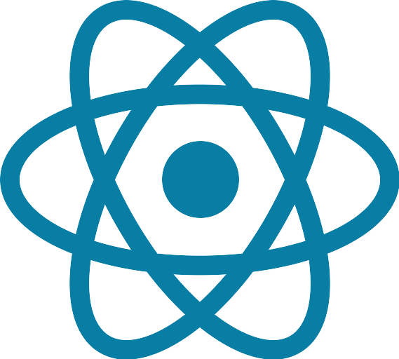
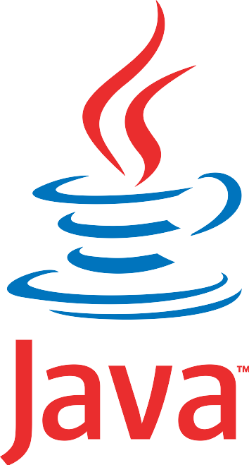
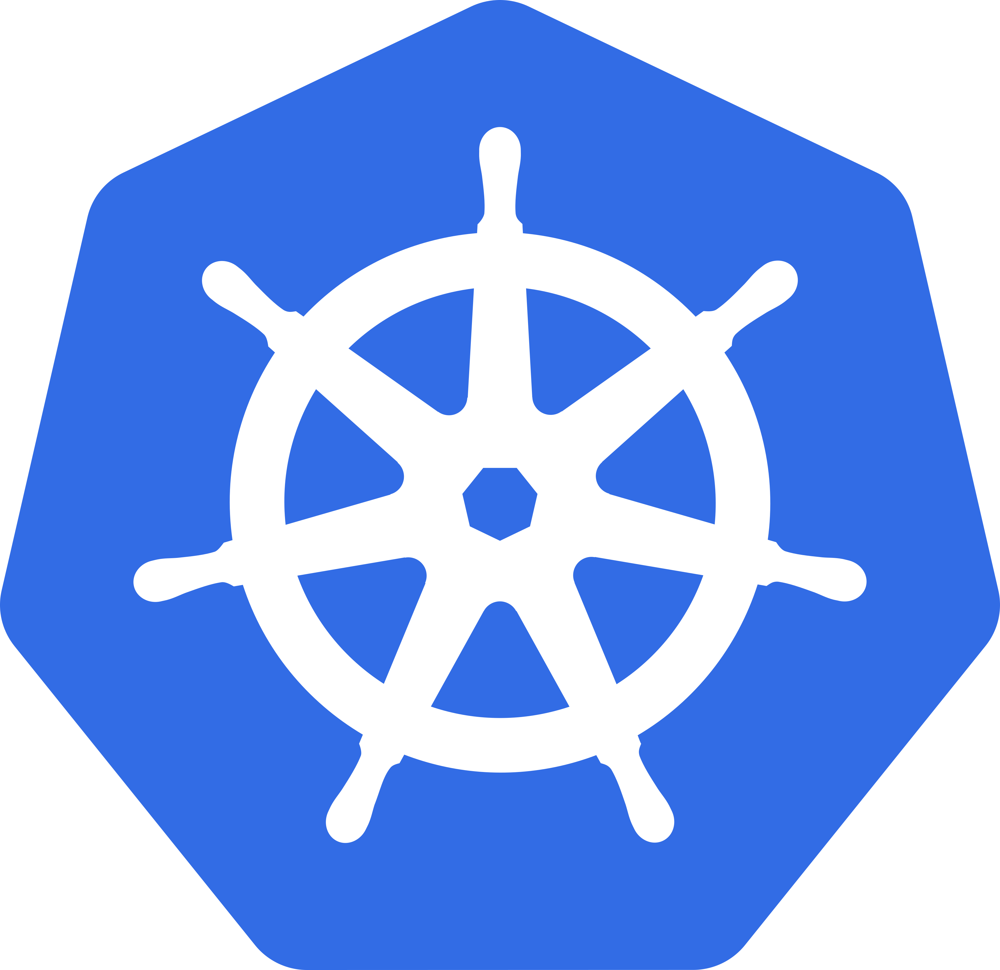

# Fullstack Demo Application

This project is a demo of the build, package, and deployment stages of a 3-tier full-stack application consisting of:

- **Frontend**: **React 18.2**
- **Backend**: **Spring Boot (Java 17)**
- **Database**: **PostgreSQL 16.4** hosted in AWS eu-north-1 via *Aiven.io*

The front and back components are built and packaged as **docker** images pushed to the public docker hub registry *jawherbelmabrouk/fullstack-demo*

The app is deployed using **Gitlab-ci** to a **kubernetes** cluster using a local **Helm** chart

## Technical environment

This project is created as a demonstration in a testing environment. Some security considerations were relaxed and future improvements are noted and being tracked.

It was created using Windows Docker Desktop with WSL2 (Ubuntu 24.04) integration and a **Kubernetes v1.30.2** cluster.
The project also uses a **self-managed gitlab runner** and a **gitlab k8s cluster agent**, both deployed inside WSL

        

    

    

        

### Helm Chart Details
The basic Helm chart is located in the /chartfullstack directory and includes:
    Deployments for the React frontend and the the Spring Boot backend.
    Service configurations for frontend and backend.

### Database Configuration
The PostgreSQL database is hosted in AWS eu-north-1 via *Aiven.io*. The credentials for the database are stored in environment variable in the helm chart's values.yaml.
These credentials are read by the backend app in application.properties file.
The credentials' security is an obvious security improvement before moving to production.

### GitLab CI Pipeline

This project uses a **GitLab-CI pipeline** for automating the build and deployment processes.

#### Multi-Stages Continuous Integratino & Deployment pipeline

1. **Build Frontend**: 
   - Uses **Kaniko** to build the React app into a Docker image.
   - Pushes the image to **Docker Hub**.

2. **Build Backend**:
   - Builds the Spring Boot backend with Maven and packages it as a Docker image using **Kaniko**.
   - Pushes the image to **Docker Hub**.

3. **Deploy to Kubernetes**:
   - Uses the **GitLab Kubernetes Agent** to install or upgrade the Helm chart in the Kubernetes cluster. The image instantiated by the runner must have the helm and kubectl utilities.

<img src="./icons/runner.png "runner")

[**kaniko**](https://docs.gitlab.com/ee/ci/docker/using_kaniko.html) is a tool to build container images from a Dockerfile, inside a container or Kubernetes cluster. kaniko offers higher performance and security vs DinD (Docker-in-Docker)

[**GitLab Cluster Agent**](https://docs.gitlab.com/ee/user/clusters/agent/ci_cd_workflow.html) is a component that enables integration between a Kubernetes cluster and GitLab-ci. The agent is installed on the cluster and communicates with the GitLab instance using the gRPC protocol to offer, for example, cluster context to pipelines. 
<img src="./icons/agent.png "agent")

## ToDo
- [x] Readme formatting
- [ ] Secure PostgreSQL & Docker Hub credentials
- [ ] Fix image vulnerabilities reported by Docker Scout
- [ ] Add pipeline triggers instead of manual
- [ ] Update DB schema handling property spring.jpa.hibernate.ddl-auto=**create-drop**
- [ ] Read Helm values as pipeline variables
